# Práctica: Arbol Binario

## Datos del Estudiante
- **Nombre:** Bryam Carchi
- **Curso:** Grupo 3 de la tarde
- **Fecha:** 16/06/2026

---

## 1. Implementación del Arbol Binario con PreOrder, PosOrder, InOrder, Niveles y altura

**Fecha:** [16/06/2026]

**Descripción:** En esta práctica aprendimos como funcionan los arboles binarios con su diferentes recorridos (preOrden, posOrden, inOrden y por niveles), para asi imprimir en consola los diferentes recorridos.

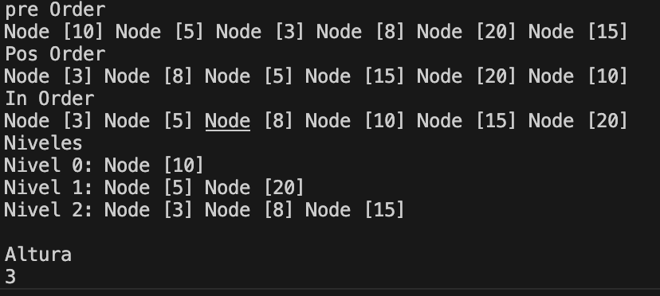
# Práctica: Arbol Binario Generico

## Datos del Estudiante
- **Nombre:** Bryam Carchi
- **Curso:** Grupo 3 de la tarde
- **Fecha:** 17/06/2026

---

## 2. Implementación de Arbol Binario Genrico

**Fecha:** [02/06/2026]

**Descripción:** Seguimos con la implementacion del Arbol Binario Y usamos las clases genericas tambien agreganos el metodo para calcular el peso del arbol (cantidad de nodos) tambien usamos el CompareTo ya que comparamos en base al nombre o la edad

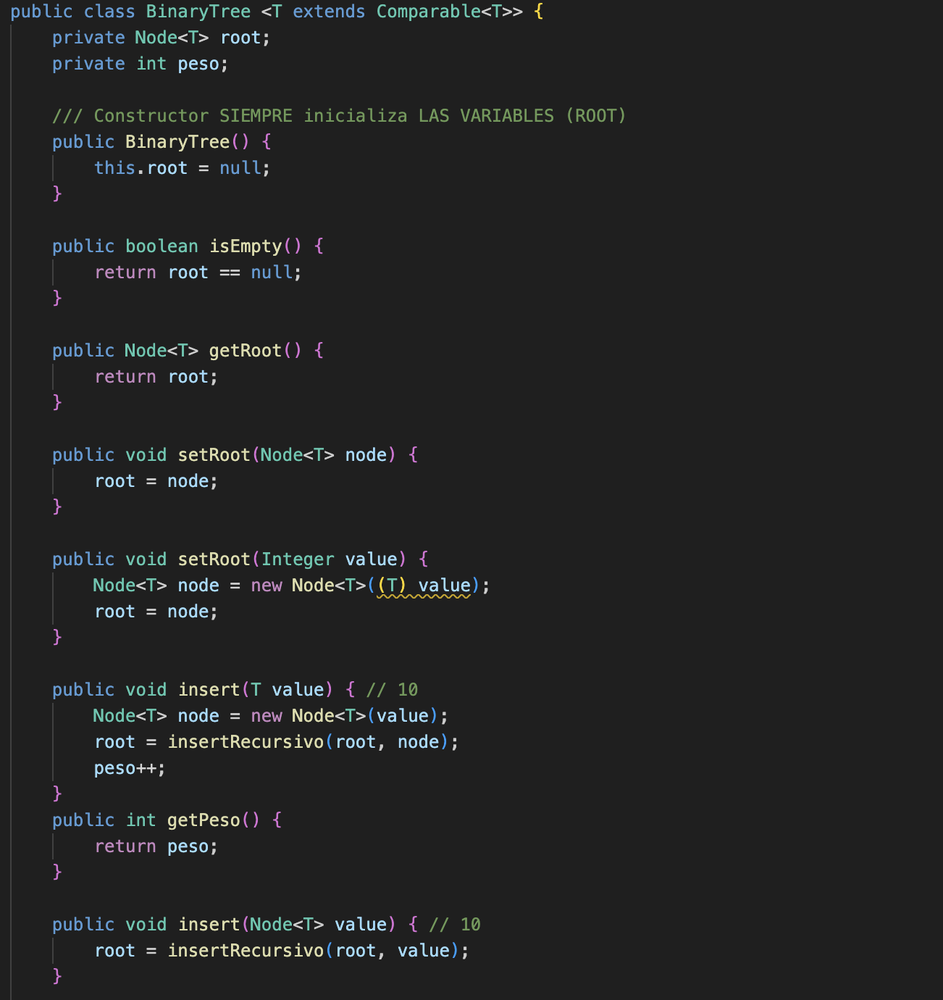
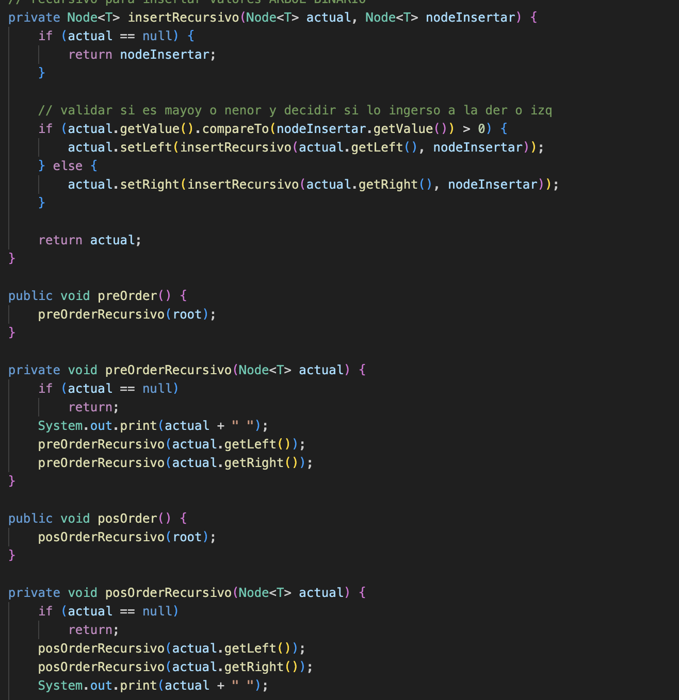
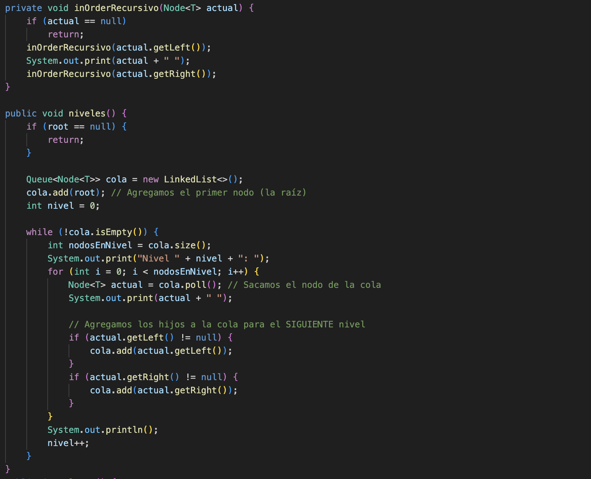
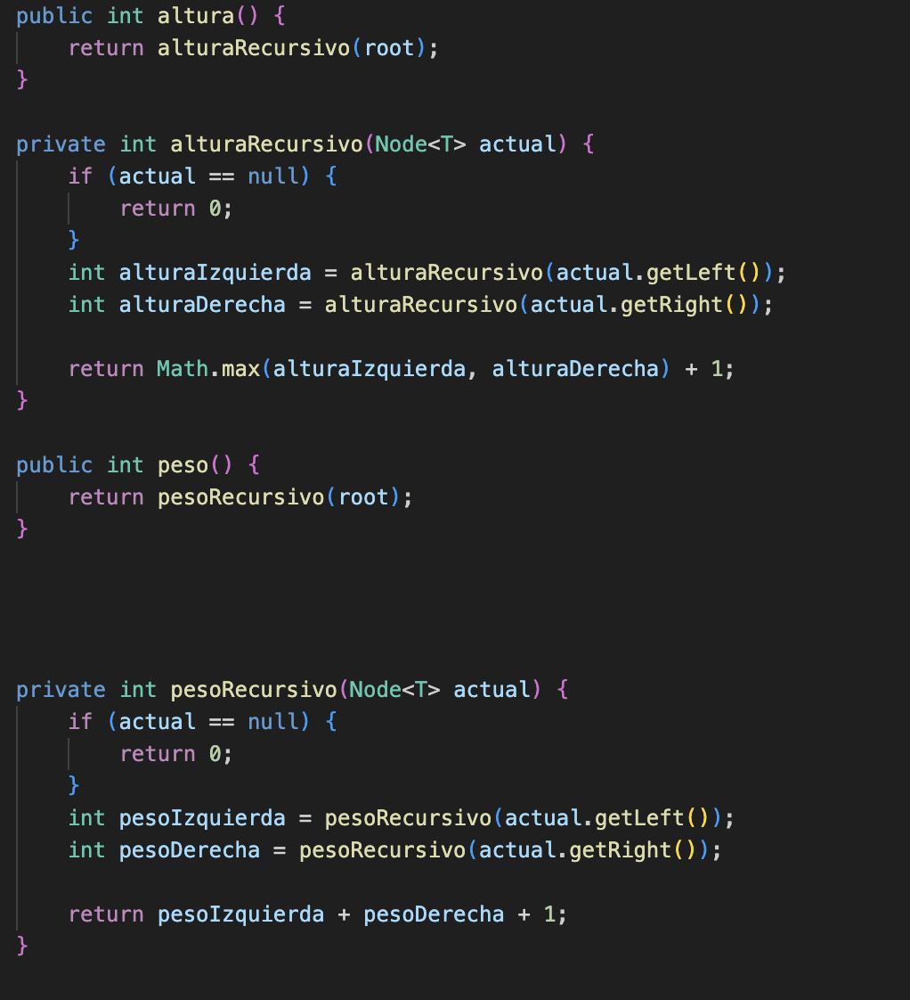
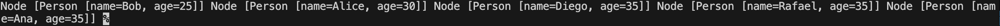

## 3. Practica de los diferentes de Sets

**Fecha:** [20/06/2026]

**Descripción:** Hoy aprendimos sobre los Sets y sus diferentes tipos el `HashSet`, `LinkedHashSet` y el `TreeSet` en donde el primero se maneja sobre La tabla Hash y no permite duplicados pero no nos asegura un orden , el segundo de igual manera no permite duplicados pero este mantendra el orden de llegada y el ultimo si podra tener un orden y nos ayudara cuando trabajamos con objetos programando un comparador 

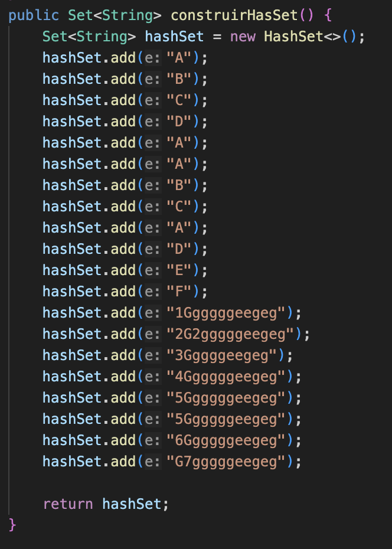
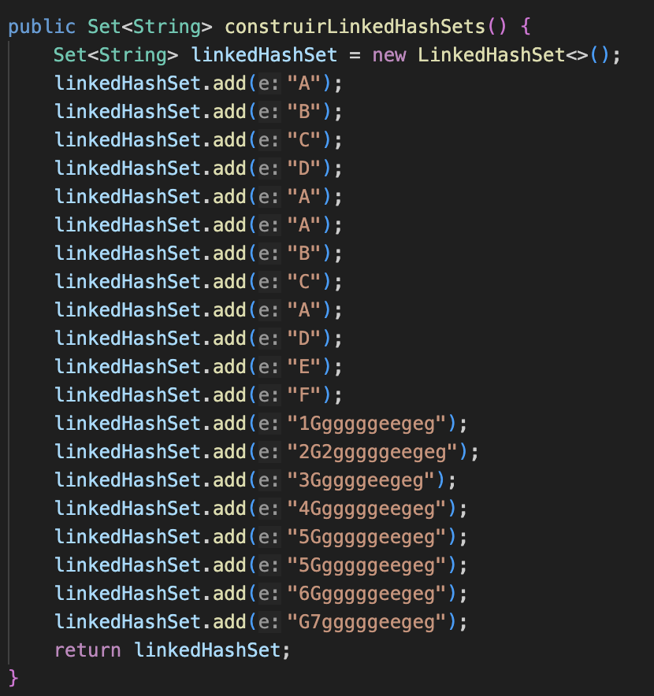
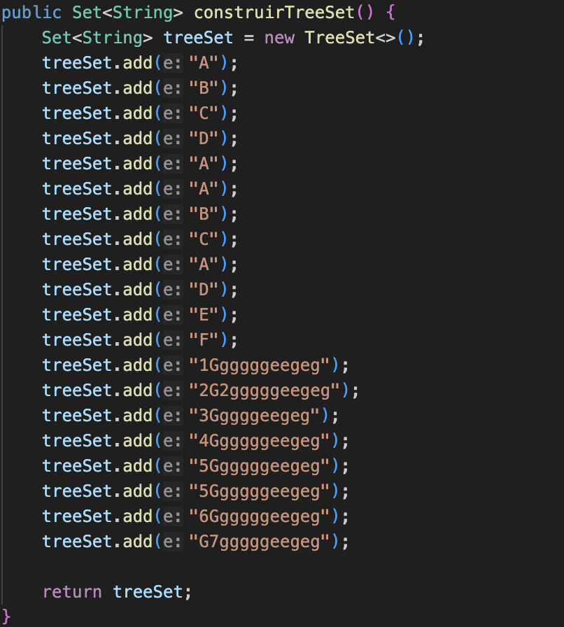
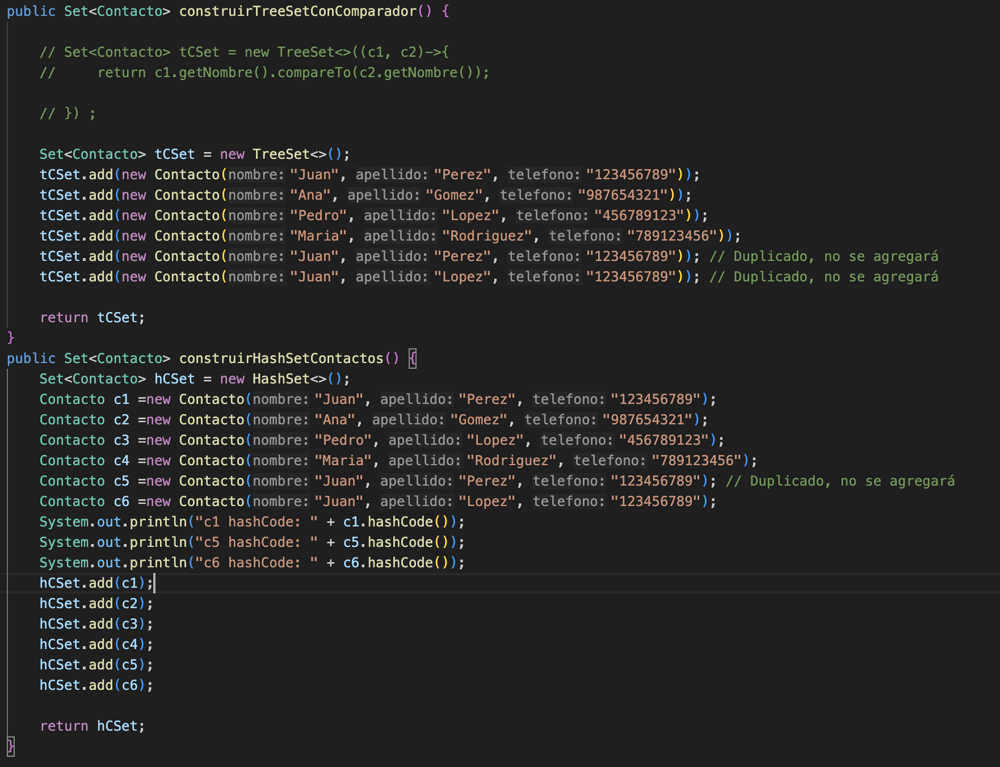
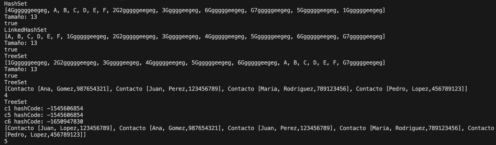

## 4. Practica de los diferentes Mapas

**Fecha:** [30/06/2026]

**Descripción:** Hoy aprendimos sobre los Mapas, que guardan la información en parejas de Clave-Valor, y sus diferentes tipos: el `HashMap`, `LinkedHashMap` y el `TreeMap`. En todos ellos, la clave no se puede duplicar. El primero (HashMap) se maneja sobre una tabla Hash y no nos asegura ningún orden para las claves; el segundo (LinkedHashMap) de igual manera no permite claves duplicadas, pero este mantendrá el orden de llegada en el que los insertamos; y el último (TreeMap) ordenará las claves automáticamente (como en orden alfabético) y nos ayudará cuando trabajamos con objetos como claves programando un comparador."
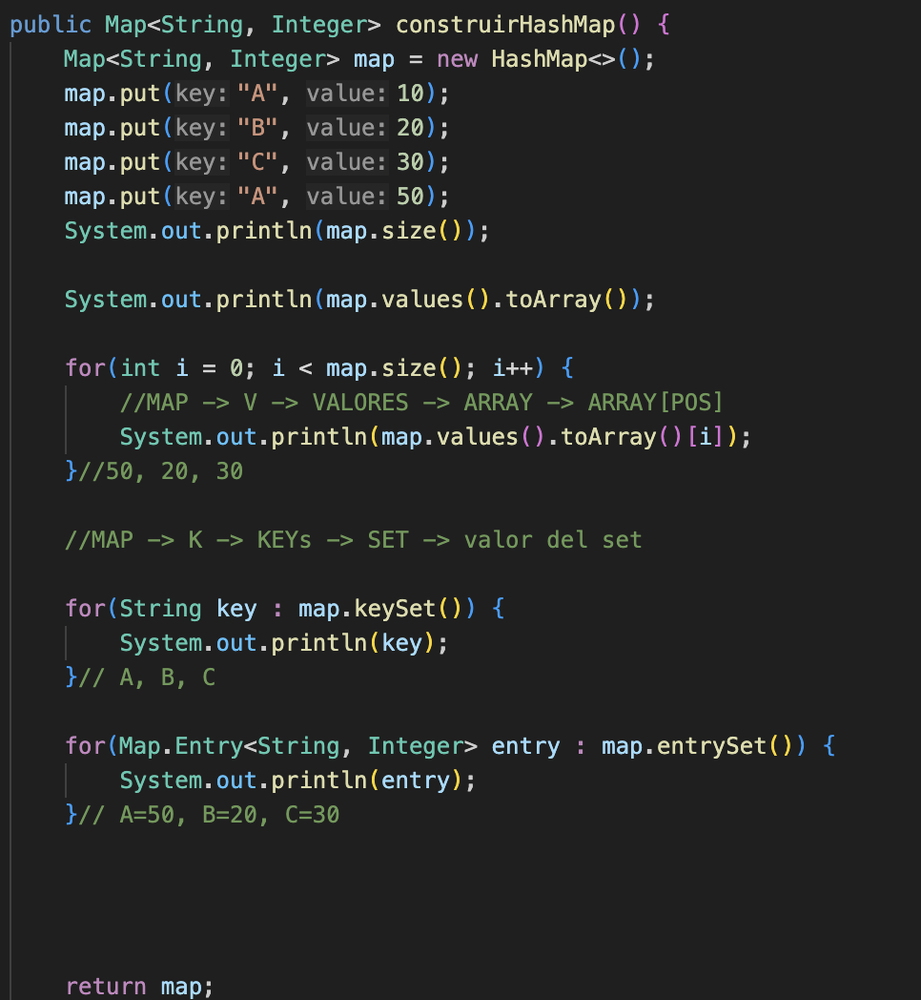
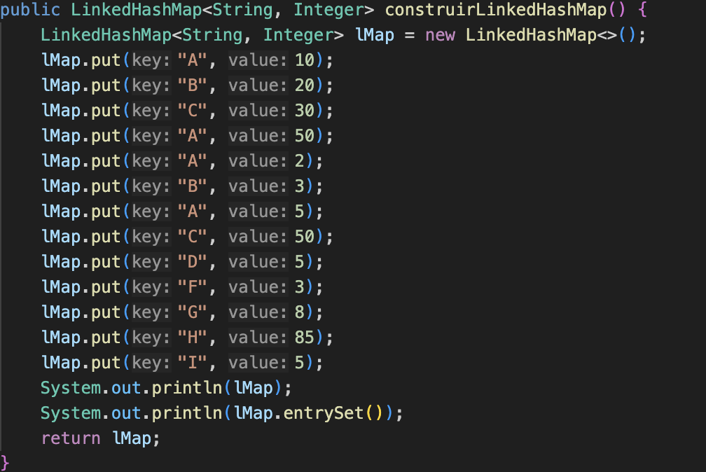
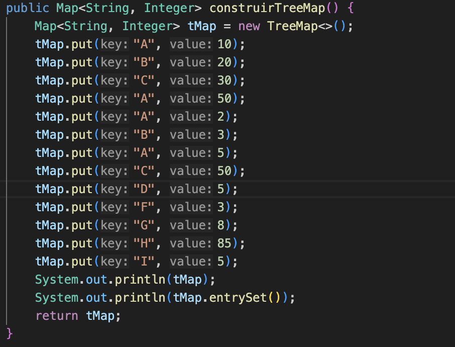
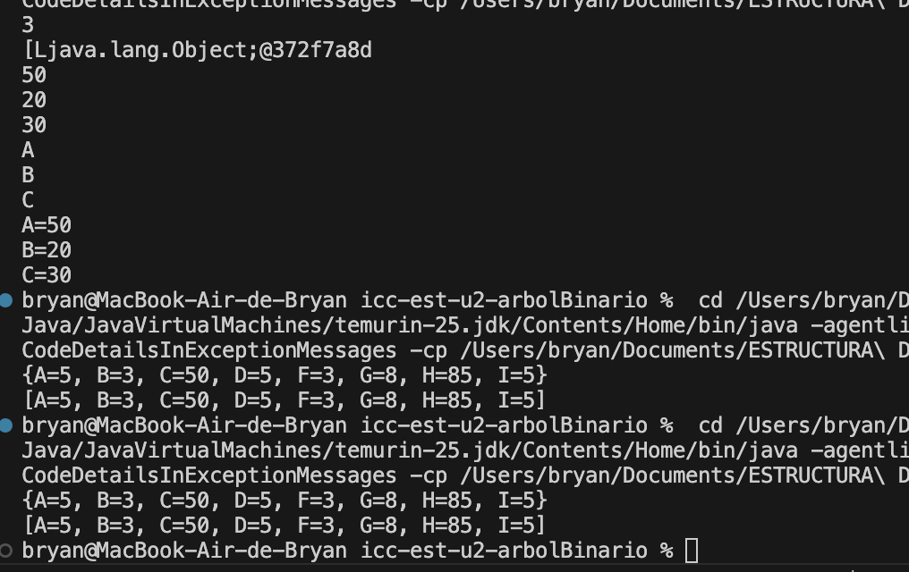
