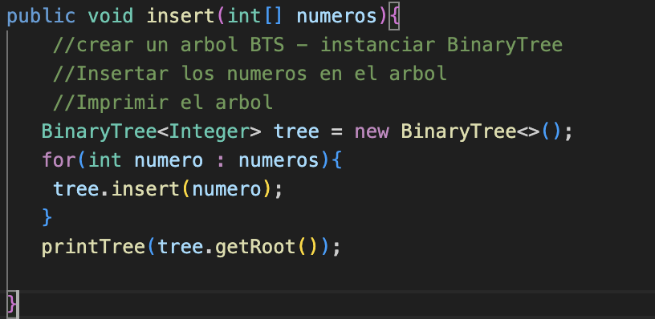
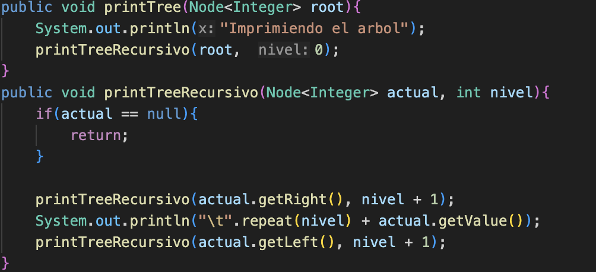
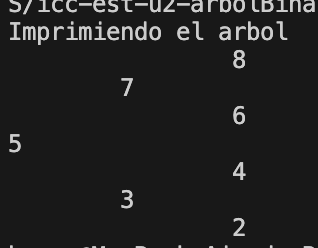
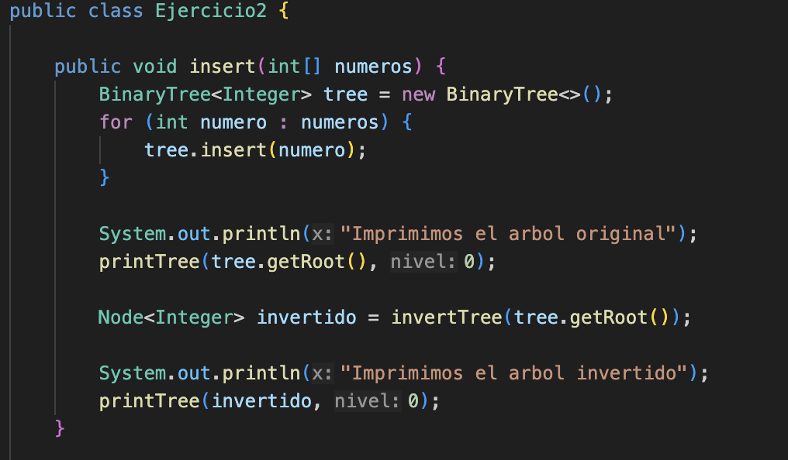
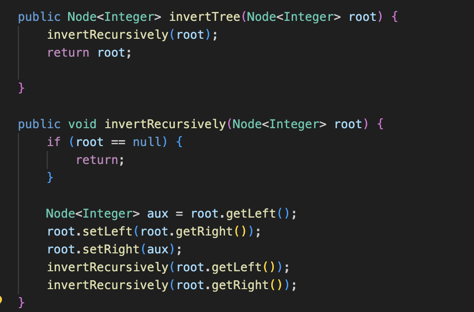
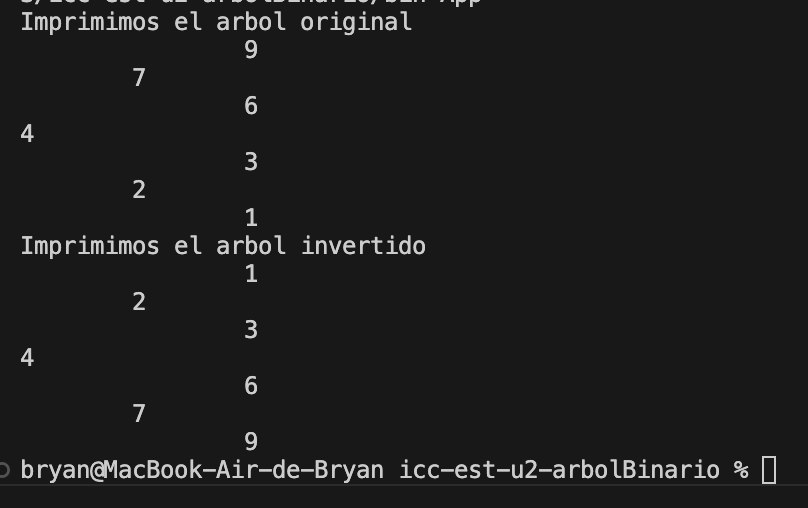

## Informe 
## **Ejercicio 1**
Informacion de un BTS en consola de manera vertical

Este es un metodo en donde instanciamos el arbol binario y luegos usamos un bucle para poder insertar los valores en cada nodo y tambien llamamos al metodo `prinTeee`.

Aqui realizamos dos metodos el `prinTree` y `prinTreeRecursivo` en donde el primero vamos utilizar como parametros de root y del nivel. En el `prinTreeRecursivo` programamos el caso base y despues lo hacemos para que empiece por el subarbol derecho y al nivel le sumamos mas 1, tambien configuramos que imprima el numero de tabulaciones de acuerdo al nivel en el que se encuentre agregando el valor del nodo y despues pase al subarbolizquierdo igual sumandole al nivel 1.
## Salida en consola

## **Ejercicio 2**

Aqui implementamos de nuevo el metodo insertar que usamos en el Ejercicio 1 utiliazando tambien el parametro de nivel y tambiense creo una variable para poder imprimir el arbol binario. invertido

Creamos el metodo `inverTree` en donde llamamos el segundo metodo `invertRecursively` en dode solo retornaremos la raiz. En el metodo `invertRecursively` igual iniciamos con el caso base y despues pasamos a crear la variable aux en donde primero guardaremos el valor del subarbolizquierdo y el valor del subarbolderecho lo pondremos en el espacio que quedo a la izquierda y en el subarbol derecho pondremos el valor previamente guardado en el aux y finalmente haremos las llamadas recursivas correspondientes
## Salida en cosola
